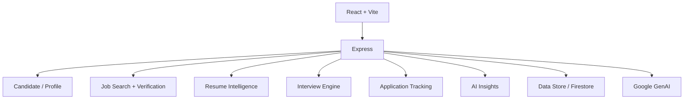

# CareerOS — AI JobHunter

AI-assisted job discovery, verification, matching, resume tailoring, interview preparation, application routing, and tracking platform.

## Product workflow

```text
Candidate profile
      ↓
Job discovery
      ↓
Requirement / candidate matching
      ↓
Job verification
      ↓
Tailored resume
      ↓
Application routing
      ↓
Interview preparation
      ↓
Application tracking
      ↓
Outcome-informed insights
```

CareerOS is designed around traceability: candidate facts, job evidence, generated artifacts, and application state should remain distinguishable rather than becoming an opaque text-generation pipeline.

## Core capabilities

- Candidate profile and skill-gap management.
- Job search, filtering, ranking, and verification.
- Resume parsing and job-specific tailoring.
- Interview preparation and answer evaluation.
- Application tracking and duplicate/conflict handling.
- Network/referral message generation.
- Salary benchmark and negotiation-draft workflows.
- Dashboard analytics and AI-generated insights.
- Firebase/Firestore-backed persistence and server-side Google GenAI integration.

## Architecture



The Express server is the provider trust boundary. API credentials and server-only integrations must not be exposed to the browser.

## Stack

| Area | Technology |
|---|---|
| UI | React, Vite, TypeScript |
| API | Express |
| AI | Google GenAI / Gemini |
| Data | Firebase / Firestore |
| Styling | Tailwind CSS |
| Runtime | Node.js / Bun-compatible tooling |
| Delivery | Vite and repository CI |

## Repository map

```text
src/                    # React application and domain types
server/                 # database, search, ranking, and AI services
server.ts               # Express API entrypoint
data/                   # application/sample data boundary
firestore.rules         # Firestore authorization rules
vite.config.ts          # Vite configuration
package.json
bun.lock
.github/workflows/
```

## Quick start

Prerequisites: Node.js-compatible runtime, package manager used by the repository, and configured Firebase/GenAI access.

```bash
git clone https://github.com/AloneRider-pixel/CareerOS.git
cd CareerOS
npm install
npm run dev
```

For build verification:

```bash
npm run lint
npm run build
```

Health endpoint: `GET /api/health`.

Keep deployment credentials outside source control. Review `firestore.rules` before changing data access.

## API surface

The server exposes flows for:

- candidate profile and settings;
- jobs, search, filters, and verification;
- resume ingestion and tailoring;
- interview preparation and evaluation;
- application creation and updates;
- search history and skill gaps;
- company/network intelligence;
- dashboard statistics and AI insights; and
- salary and negotiation assistance.

API contracts are implemented in `server.ts` and the supporting `server/` services.

## Security and truthfulness

Treat resumes, job descriptions, recruiter/network data, provider responses, model output, and user-submitted text as untrusted.

CareerOS should not fabricate candidate facts, recruiter identities, company claims, URLs, application outcomes, or unsupported skills. Preserve explicit unknown states and validate external inputs at the server boundary.

## Evidence policy

Deterministic application behavior and sample data are engineering evidence, not proof of job-market outcomes or employer decisions. Claims about ranking quality, parsing quality, or application performance should identify the dataset, methodology, environment, sample count, and producing commit.

## Documentation

Start with `server.ts`, the `server/` services, `firestore.rules`, and repository workflows when making architectural changes.

## Contribution standard

Keep generated candidate artifacts traceable to source data, preserve authorization boundaries, add regression coverage for business-rule changes, and avoid hard-coding secrets or employer-specific assumptions.

## License

MIT
